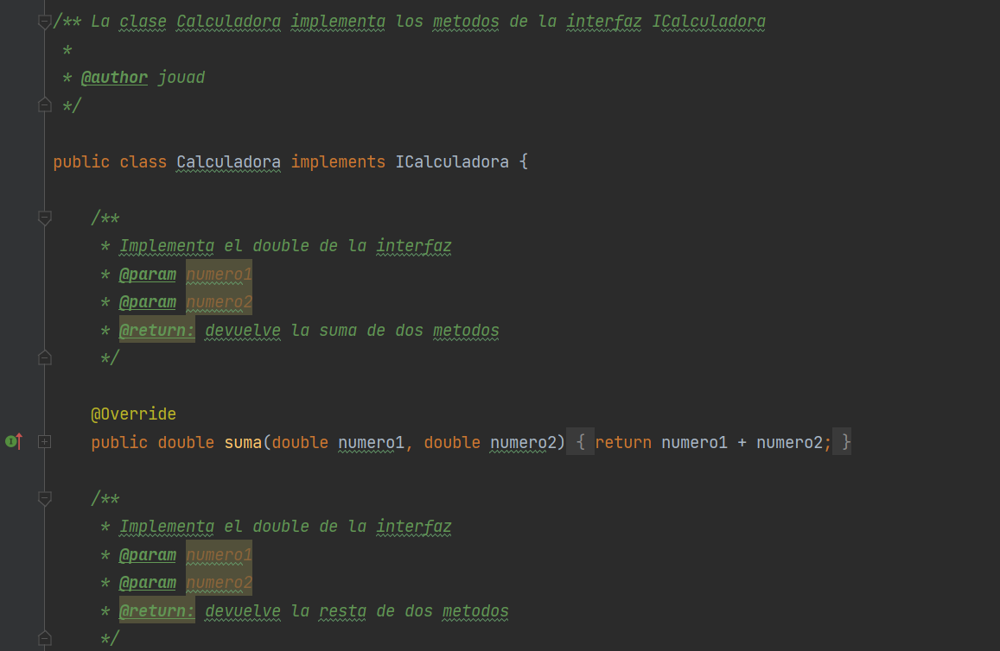
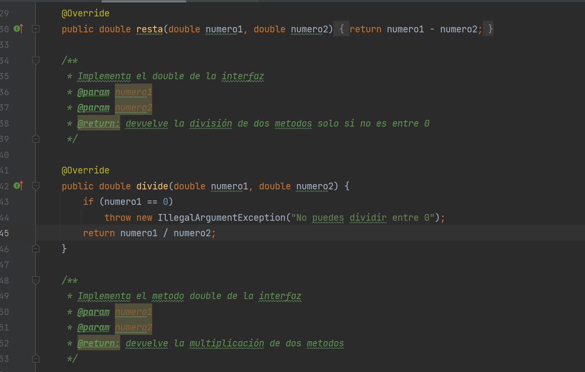
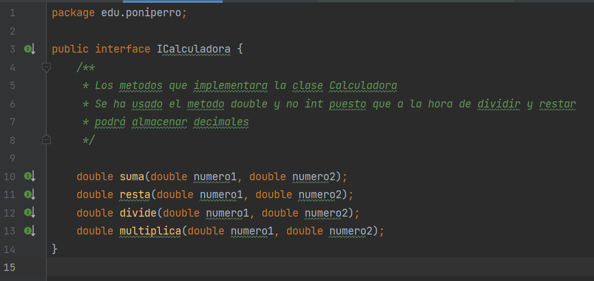
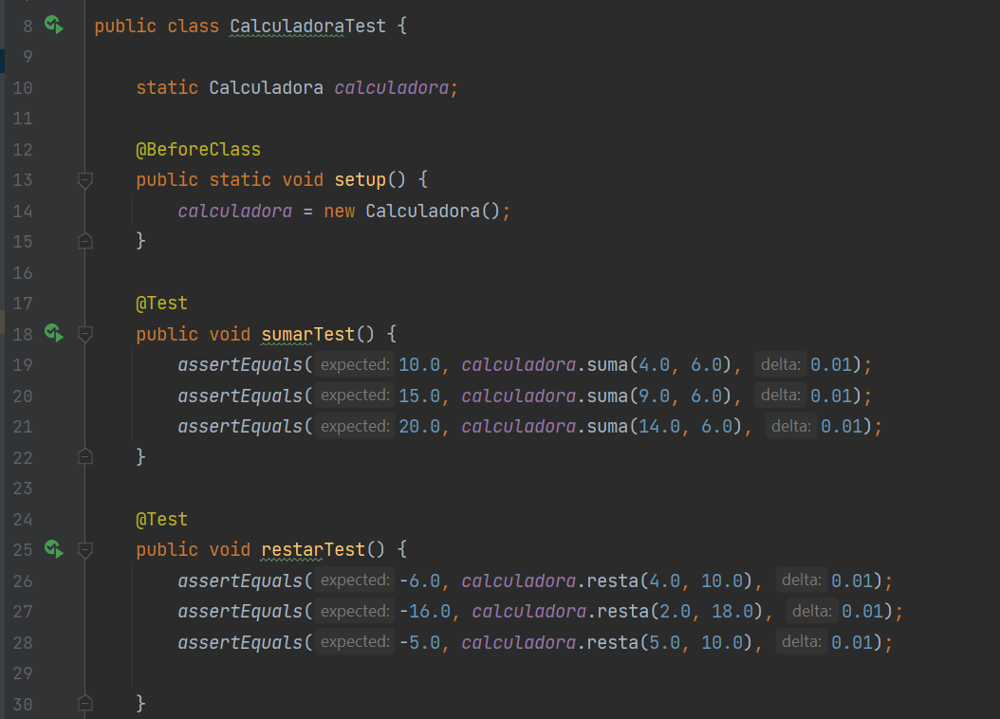
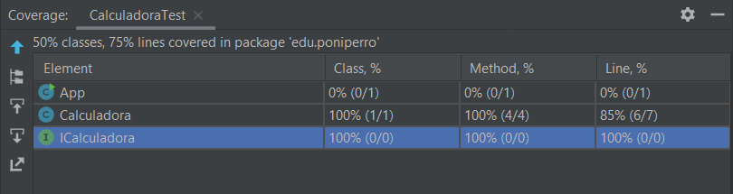
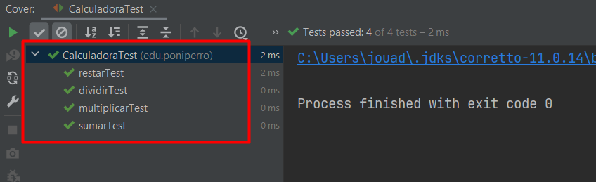

# Practica5-ED

### Instrucciones:
1. Crea un nuevo proyecto en github, por nombre Practica5.
2. Crea la interfaz ICalculadora con las operaciones sumar, restar,
   multiplicar y dividir.
3. Crea la clase calculadora que utilice la interfaz anterior e implementa los
   métodos.
4. Realiza el primer commit a github.
5. Luego, crea los test unitarios en JUnit (igual no es necesario descargarlo
   porque puede venir incluido en vuestro IDE) de estos cuatro métodos.
6. Realiza el segundo commit.
7. Realiza diferentes pruebas para validar que los test funcionan y expón
   los resultados obtenidos, % de tests pasados etc.

## Clase calculadora

*JavaDoc*

## Interfaz calculadora

*Metodos sumar, restar, dividir y multiplicar* + *Javadoc*

## Casos test

*Test para los métodos*

*Resultados obtenidos del testing*

